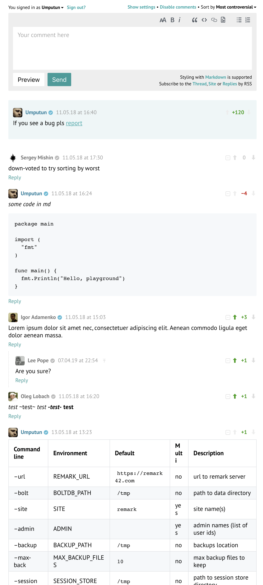

# Remark42    

Remark42 is a self-hosted, lightweight and simple (yet functional) comment engine, which doesn't spy on users. It can be embedded into blogs, articles, or any other place where readers add comments.

* Social login via Google, Twitter, Facebook, Microsoft, GitHub, Yandex, Patreon and Telegram
* Login via email
* Optional anonymous access
* Multi-level nested comments with both tree and plain presentations
* Import from Disqus and WordPress
* Markdown support with friendly formatter toolbar
* Moderator can remove comments and block users
* Voting, pinning and verification system
* Sortable comments
* Images upload with drag-and-drop
* Extractor for recent comments, cross-post
* RSS for all comments and each post
* Telegram, Slack, Webhook and email notifications for Admins (get notified for each new comment)
* Email and Telegram notifications for users (get notified when someone responds to your comment)
* Export data to JSON with automatic backups
* No external databases, everything embedded in a single data file
* Fully dockerized and can be deployed in a single command
* Self-contained executable can be deployed directly to Linux, Windows and macOS
* Clean, lightweight and customizable UI with white and dark themes
* Multi-site mode from a single instance
* Integration with automatic SSL (direct and via [nginx-le](https://github.com/nginx-le/nginx-le))
* [Privacy focused](https://remark42.com/#privacy)

[Demo site](https://remark42.com/demo/) available with all authentication methods, including email auth and anonymous access.

Screenshots

Comments example:

For admin screenshots see [Admin UI documentation](https://remark42.com/docs/manuals/admin-interface/)

All remark42 documentation is available [by the link](https://remark42.com/docs/getting-started/installation/).

## Related projects

* [A Helm chart for Remark42 on Kubernetes](https://github.com/groundhog2k/helm-charts/tree/master/charts/remark42)
* [django-remark42](https://github.com/andrewp-as-is/django-remark42.py)
